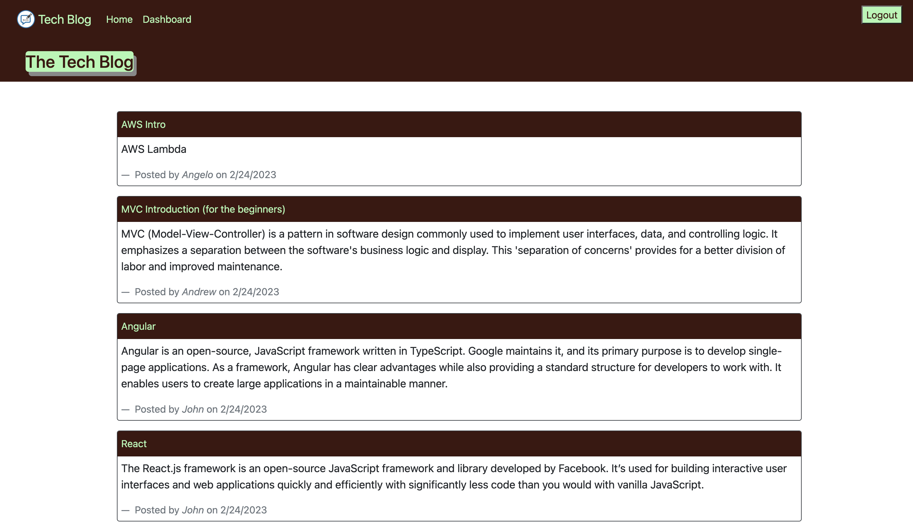
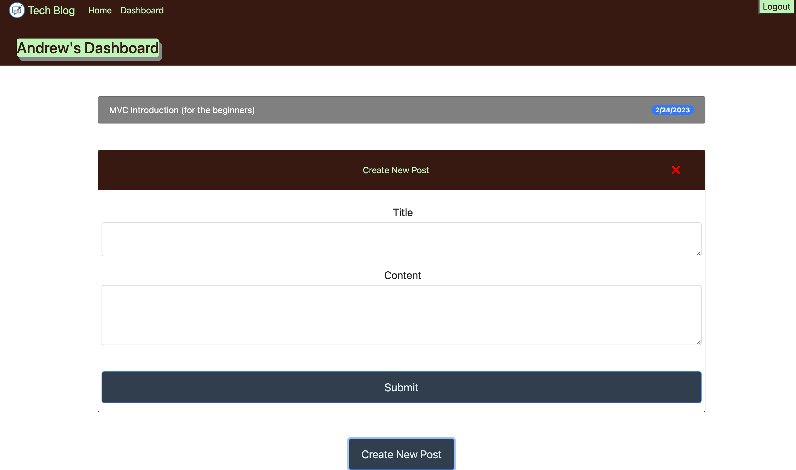
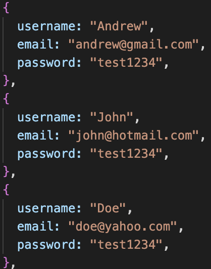

# Project Name

## Table of contents

- [Overview](#overview)
  - [The challenge](#the-challenge)
  - [Screenshot](#screenshot)
  - [Links](#links)
- [My process](#my-process)
  - [Built with](#built-with)
  - [Setup](#setup)
  - [What I learned](#what-i-learned)
- [Author](#author)

## Overview

### The challenge

Using an MVC framework for building a web application with session-based authentication, and then deploy it on Heroku.

### Screenshot

|  |
| :-------------------------------: |
|        _↑ Web Homepage ↑_         |

|  |
| :-------------------------------: |
|      _↑ User's Dashboard ↑_       |

### Links

- GitHub URL: [GitHub Repo](https://github.com/Andrew-TechMaster/Andrew-UWBootcampChallenge-12-Tech-Blog)
- Live Site URL: [https://warm-headland-38704.herokuapp.com/](https://warm-headland-38704.herokuapp.com/)

## My process

### Built with

- Cloud: Heroku
- Frontend: HTML, CSS, Bootstrap
- Template Engine: Handlebars
- Backend: Node, Express
- Database: MySQL

### Setup

> - To install dependencies, run "npm i" and then start the application with "node index"
>
> - Accessing the db folder, use the command "mysql -u root -p" to enter the MySQL terminal. After entering your password, execute the commands "source schema.sql" to set up the database
>
> - Use the command "npm run seed" or "node seeds/index.js" to initiate and set up the tables
>
> - Execute the command "npm run watch" or "nodemon server.js" to enhance the speed and efficiency of Node.js application development
>
> - You can attempt to log in using the provided seed data or create your own account by signing up.
> - 
>
> **Note**: Don't forget to rename '.env.Example' to '.env' and update the default settings with your own

### What I learned

> - Hiding database configuration sensitive information (DB_NAME, DB_USER, and DB_PASSWORD) by utilizing [dotenv](https://www.npmjs.com/package/dotenv)
>
> - Connecting to MySql database using [MySQL2](https://www.npmjs.com/package/mysql2)
>
> - Utilizing [Sequelize](https://www.npmjs.com/package/sequelize) as the Object-Relational Mapping (ORM) tool to simplify and streamline database interactions
>
> - By binding data to templates, [Handlebars](https://handlebarsjs.com/guide/) serves as a template engine that allows for the dynamic generation of HTML.
>
> - [express-session](https://expressjs.com/en/resources/middleware/session.html) provides the ability to manage user sessions and enable session-based authentication.

## Author

Andrew (Sheng-Chu), Chou

- Website - [Andrew Chou](https://andrew-techmaster.github.io/Andrew-UWBootcamp-Challenge-02/)
- GitHub - [Andrew-TechMaster](https://github.com/Andrew-TechMaster)

© 2023 edX Boot Camps LLC. Confidential and Proprietary. All Rights Reserved.
